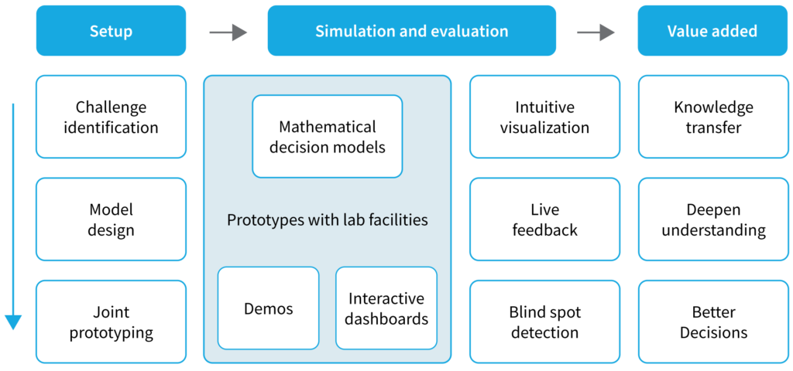

The CAVE Lab (CAVE = Computational Analytics, Visualisation, and Education) at the Luxembourg Centre for Logistics and Supply Chain Management (LCL) is a state-of-the-art facility that promotes collaboration and communication between industry practitioners and academic researchers.

The lab is equipped with advanced visualization technologies to facilitate joint prototyping sessions in which participants work together to co-create interactive dashboards for mathematical decision models.

In the lab industry, practitioners and academic researchers come together to work on a common project. The goal of these sessions is to co-create interactive dashboards for mathematical decision models that can be used to digitalise decision-making in supply chain management, procurement, and logistics. During the session, participants work together to design and build prototypes of the dashboards using the lab’s advanced visualisation technologies.

